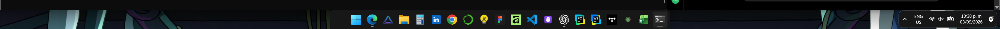

# Emi Liquid Glass Dock

Windows 11 taskbar styled as a floating liquid-glass dock: blur, rounded capsule, hover magnification, auto-hide, and a tray that only appears when you need it. On Windows 10 the installer applies a frosted-glass floating bar (native acrylic helper) with fully visible centered icons (TaskbarX).



This repo is a **shareable preset**, not a closed app. Friends download a zip, extract it, double-click `INSTALAR.bat`, and get the same look. There is also a one-click `Setup.exe` for a portfolio download page.

## What it does

- Floating centered dock with **Liquid Glass** blur and a 5px radius
- macOS-style **icon magnification** on hover (no bounce)
- Auto-hide when a window covers the bar; only the center of the bottom edge wakes it
- System tray hidden until hover
- Dark Windows 11 chrome, widgets off, taskbar centered

## Requirements

- Windows 11 (build 22000+) for the full Liquid Glass look, or Windows 10 (2004+, build 19041+) for the frosted-glass floating dock
- Internet the first time (Windows 11 downloads [Windhawk](https://windhawk.net/); Windows 10 downloads [TaskbarX](https://github.com/ChrisAnd1998/TaskbarX) and compiles the glass helper)
- On Windows 11, Windhawk **2.0** (the installer fetches `2.0.0-alpha.3`)

## Install (friends)

**Zip (best to send):**

1. Download **`Emi-Windows-Dock-v1.0.1.zip`** from [Releases](../../releases) or `dist/` after packing.
2. Right-click → **Extract All**. Do not run `INSTALAR.bat` from inside the zip window.
3. Double-click **`INSTALAR.bat`**.
4. If SmartScreen appears: **More info → Run anyway**.
5. Hover the **center** of the bottom edge. The dock slides up.

**Installer (portfolio):** download **`Emi-Windows-Dock-Setup-v1.0.1.exe`** and click Instalar.

Spanish steps: `LEEME.txt` and [docs/INSTALACION.md](docs/INSTALACION.md).

Manual:

```powershell
powershell -NoProfile -ExecutionPolicy Bypass -File .\scripts\Install-EmiDock.ps1
```

Undo: `DESINSTALAR.bat`, or:

```powershell
powershell -NoProfile -ExecutionPolicy Bypass -File .\scripts\Uninstall-EmiDock.ps1
```

The uninstaller disables the mods. Windhawk itself stays installed.

## Install from Git

```powershell
git clone https://github.com/TU_USUARIO/windows-dock-mod.git
cd windows-dock-mod
.\INSTALAR.bat
```

Replace `TU_USUARIO` after you publish the repo.

## Project layout

```
windows-dock-mod/
  LEEME.txt                    # Spanish steps for friends
  INSTALAR.bat                 # zip installer
  DESINSTALAR.bat
  dist/emi-windows-dock.whdata # Windhawk archive (mods + settings)
  dist/*.zip / *.exe           # generated by Pack-Release.ps1
  presets/                     # readable JSON / INI settings
  registry/                    # Windows 11 tweaks (no pinned apps)
  screenshots/
  scripts/
    Install-EmiDock.ps1
    Uninstall-EmiDock.ps1
    Pack-Release.ps1           # builds zip + Setup.exe
    Export-EmiDock.ps1         # refresh preset from this PC
  setup/EmiDockSetup/          # WinForms installer source
  docs/
```

Pinned apps are **not** included. Everyone keeps their own icons.

## Publish to GitHub

See [docs/GITHUB.md](docs/GITHUB.md). Short version:

```powershell
cd "C:\Users\maste\OneDrive\Desktop\dev emi\windows-dock-mod"
.\scripts\Pack-Release.ps1
gh repo create windows-dock-mod --public --source . --remote origin --push
gh release create v1.0.1 dist\Emi-Windows-Dock-v1.0.1.zip dist\Emi-Windows-Dock-Setup-v1.0.1.exe -t "Emi Windows Dock v1.0.1" -n "Extract the zip and run INSTALAR.bat, or use Setup.exe."
```

Send friends `dist\Emi-Windows-Dock-v1.0.1.zip`. Put the Setup.exe on your portfolio download button.

## Stack

| Layer | Tool |
| --- | --- |
| Mod engine | [Windhawk](https://windhawk.net/) 2.0 |
| Look | Windows 11 Taskbar Styler · LiquidGlass2 |
| Motion | Taskbar Dock Animation Plus |
| Hide / reveal | auto-hide mods + tray-on-hover |
| Pack | PowerShell installer + `.whdata` archive |
| Windows 10 fallback | Acrylic glass helper + [TaskbarX](https://github.com/ChrisAnd1998/TaskbarX) (center only) |

Credits for each mod: [CREDITS.md](CREDITS.md).

## License

MIT for this pack (scripts, presets, docs). Windhawk and the original mods keep their own licenses (typically GPL-3.0).
